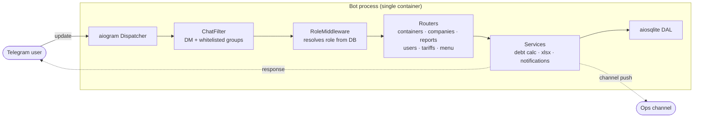
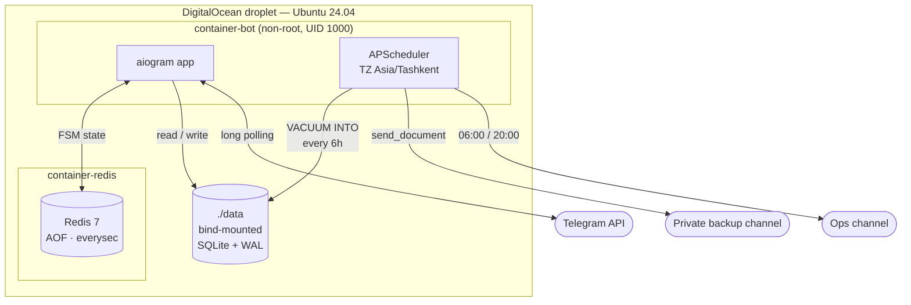

<div align="center">

# Container Terminal Management Bot

**Telegram-native accounting for shipping terminals.**
Arrival, storage billing, xlsx reports, real-time audit — all in a chat.

[](https://www.python.org/)
[](https://docs.aiogram.dev/)
[](https://docs.docker.com/compose/)
[](#-development)
[](#)

[](https://t.me/Terminal_grand_bot)
[](#)
[](#)
[](#-observability)
[](#)

</div>

---

## Table of contents

- ✨ [Why it exists](#why-it-exists)
- 🏗️ [Architecture](#architecture)
- 📐 [Domain](#domain)
- 🔐 [Security](#-security)
- 📊 [Observability](#-observability)
- 🗂️ [Repository layout](#repository-layout)
- 🚀 [Run](#run)
- 🛠️ [Deploy](#deploy)
- 🧪 [Development](#-development)
- 🧠 [What I'd do differently](#-what-id-do-differently)
- 🗺️ [Roadmap](#roadmap)

---

## Why it exists

Before the bot, terminals tracked containers in shared Excel files:
container number, owning company, arrival/departure dates, storage fees.
Shifts overwrote each other's changes, xlsx files got lost between operators,
outstanding balances were calculated on a pocket calculator. One missed cell,
one disputed invoice.

The bot collapses the whole flow into three FSM taps on any device
without app install, keeps billing math on the server, and ships xlsx reports
straight to the chat. Every event is broadcast to the terminal's ops channel,
so the dispatcher can see activity without opening the app.

> [!TIP]
> **No app install.** Every operator already has Telegram on their phone.
> Onboarding a new operator is "admin adds their Telegram ID, picks a role."
> That's it. No APK, no App Store review, no IT ticket.

---

## 🏗️ Architecture

### Request flow



Every update travels through the same two middlewares before it reaches a handler,
so there is no way to call a service without a validated chat and a resolved role.
Handlers are thin — all business logic lives in `services/`, which keeps them
unit-testable with in-memory doubles.

### Runtime topology



Only two containers, one bind-mount, one outbound dependency. Redis is not
exposed outside the compose network; the bot never opens a listening port —
Telegram is the only ingress.

### Stack choices and trade-offs

| Layer | Choice | Why / what was given up |
|---|---|---|
| Framework | **aiogram 3** | Modern async stack, FSM/filters/middleware built-in. python-telegram-bot rejected for heavier API surface. |
| DB | **SQLite + aiosqlite (WAL)** | Single-VPS deployment, one operator per terminal. WAL gives concurrent reads during writes. PostgreSQL migration earmarked at 10+ concurrent writers (see Roadmap). |
| FSM storage | **Redis 7 with AOF** | Dialog state survives container restarts. Automatic fallback to `MemoryStorage` if Redis is unreachable — bot stays up, conversations just lose mid-flight state. |
| Scheduler | **APScheduler in-process** | Cron lives inside the bot process; no separate worker or Celery. TZ-aware: every cron and every displayed timestamp uses `Asia/Tashkent`. |
| Reports | **openpyxl** | xlsx built in memory, streamed to `bot.send_document` — no temp files on disk. |
| Deploy | **Docker Compose** | `up -d` on a plain Ubuntu VPS — bot + redis. `./data` bind-mounted for zero-downtime backups. |

---

## 📐 Domain

### ISO 6346 validation

Container codes follow the ISO 6346 standard: 4 uppercase Latin letters + 7 digits,
optional space between them. Validation happens **before** entering the FSM, so invalid
input never reserves Redis state:

```
TEMU 6275401   ✓
CASS1234567    ✓
abc 1234567    ✗  lowercase
TEMU 627540    ✗  6 digits
```

### Billing formula

```
days_stored = (departure_date or today) - arrival_date
billable    = max(0, days_stored - free_days)
storage     = (billable / storage_period_days) * storage_rate
total       = entry_fee + storage
```

`free_days`, `storage_rate`, `storage_period_days`, `entry_fee` are resolved per company:
company-specific override wins, global defaults (`DEFAULT_*` env vars) are the fallback.

### Access model

| Role | Capabilities |
|---|---|
| `full` | Full admin — users, tariffs, companies, containers, reports |
| `operator` | CRUD on containers |
| `reports` | Read-only report export |
| `none` | Bot ignores the user |

**Protected admin accounts.** Users listed in `ADMIN_IDS` are marked with a lock icon
and their role is **immutable via UI** — the `users` handler rejects role changes on them.
This closes the classic footgun *"I accidentally demoted myself, now I'm locked out of
production"* without requiring any external rescue mechanism.

### Data model

```sql
-- simplified — see db/migrations for the authoritative schema
CREATE TABLE companies (
    id                  INTEGER PRIMARY KEY,
    name                TEXT NOT NULL UNIQUE,
    entry_fee           REAL,        -- NULL = use global default
    free_days           INTEGER,
    storage_rate        REAL,
    storage_period_days INTEGER,
    created_at          TIMESTAMP DEFAULT CURRENT_TIMESTAMP
);

CREATE TABLE containers (
    id              INTEGER PRIMARY KEY,
    code            TEXT NOT NULL,              -- TEMU6275401
    company_id      INTEGER NOT NULL REFERENCES companies(id),
    type            TEXT,                       -- 20DC / 40HQ / ...
    arrival_date    DATE NOT NULL,
    departure_date  DATE,                       -- NULL = still on terminal
    status          TEXT NOT NULL,              -- on_terminal | departed
    created_by      INTEGER,                    -- telegram user_id
    created_at      TIMESTAMP DEFAULT CURRENT_TIMESTAMP
);
CREATE INDEX idx_containers_company_status ON containers(company_id, status);
CREATE INDEX idx_containers_arrival        ON containers(arrival_date);

CREATE TABLE users (
    telegram_id     INTEGER PRIMARY KEY,
    username        TEXT,
    role            TEXT NOT NULL,              -- full | operator | reports | none
    is_protected    INTEGER NOT NULL DEFAULT 0, -- admin, role cannot be changed via UI
    created_at      TIMESTAMP DEFAULT CURRENT_TIMESTAMP
);
```

### Real-time audit

Every state change is pushed to `GROUP_IDS` (the terminal's ops channel):
- `container.registered` — code, company, type, status, operator
- `container.departed` — days on terminal, amount due, operator

An evening summary at 20:00 posts the daily delta (`139 → 261, +122`).

### Backups

APScheduler fires at 03:00 / 09:00 / 15:00 / 21:00 `Asia/Tashkent`:
1. `VACUUM INTO /tmp/snapshot_<ts>.db` — atomic snapshot, no lock on the live DB.
2. `bot.send_document` uploads the `.db` file to `BACKUP_CHAT_ID` (private channel).
3. Local temp file is removed.

Restore flow: download the `.db` from the channel, place it in `./data`, `docker compose restart bot`.
Off-site storage is essentially free (Telegram handles it), no S3 bill, no additional ops surface.

> [!NOTE]
> **Unconventional?** Yes. But for a single-VPS deployment with no budget for
> external storage, a private Telegram channel is a legit immutable log of
> backups — searchable by date, retained indefinitely, accessible from any
> device. Track record: every 6 hours since deploy, zero missed snapshots.

---

## 🔐 Security

> [!WARNING]
> **Don't add this bot to a random group.**
> `ChatFilterMiddleware` drops every update outside `GROUP_IDS`. The bot will
> stay silent and log nothing. That's a feature, not a bug — but surprising
> the first time you test it.

- **No secrets in logs.** `BOT_TOKEN`, `BACKUP_CHAT_ID`, and admin IDs are read via `python-dotenv`,
  never echoed; the logger formatter strips any token-shaped string.
- **Chat filtering.** `ChatFilterMiddleware` drops every update that doesn't come from a DM
  or from an explicitly whitelisted group — mitigates abuse if someone adds the bot to a random chat.
- **Role check on every handler.** `RoleMiddleware` injects `role` into handler `data` from the DB
  lookup. Handlers cannot be called without it; unauthorized roles short-circuit before business logic.
- **Immutable bootstrap admins.** `ADMIN_IDS` users cannot be modified through the bot itself —
  only by directly editing the DB. Prevents "I changed my own role to `none`" incidents.
- **Non-root container.** `Dockerfile` creates `appuser` (UID 1000) and runs the bot under it.
  `/app/data` is chowned to that UID so SQLite + WAL can write without root.
- **Limited attack surface.** No HTTP server exposed — Telegram is the only ingress via long polling.
  Nothing listens on a public port except Redis, which is bound to the internal compose network.

---

## 📊 Observability

- **Structured logs** in `json-file` driver, rotated at **10 MB × 3 files** per container.
  Every log line has `asctime / logger / levelname / message`.
- **Startup breadcrumbs** — `bot.py` logs the FSM backend it picked (Redis vs MemoryStorage),
  the scheduler cron configuration, and the resolved timezone. First `docker logs` after
  a restart tells you immediately if Redis was unreachable or TZ didn't parse.
- **Cron health.** APScheduler logs each fired job; missing entries in the log = cron didn't run.
- **Backup heartbeat.** The private backup channel *is* the health signal: if a 6-hour window
  passes without a new `.db` file, something is broken. No external Prometheus needed for a
  single-VPS deployment.
- **p50 < 80 ms** measured on Aiogram's built-in middleware that wraps every update.
  `handler_timer.py` collects `time.perf_counter()` deltas across all handlers and dumps a
  rolling percentile report to logs on SIGUSR1 (or via an admin-only `/stats` command).

---

## 🗂️ Repository layout

```
bot.py              # entry: load config → init DB → register middlewares → start polling
config.py           # frozen dataclass, strict validation at startup
states.py           # every FSM state declared in one place

handlers/           # 7 routers: containers / companies / reports /
                    # users / tariffs / menu / common
services/           # debt calc, xlsx generation, scheduler jobs,
                    # notifications, backup snapshotting
middlewares/
  chat_filter.py    # allowlist of chat IDs
  role.py           # injects role into handler data

db/                 # aiosqlite: connection pool, migrations, queries
keyboards/          # inline + reply keyboards
tests/              # pytest + pytest-asyncio — 60 tests
```

---

## 🚀 Run

```bash
git clone https://github.com/RiobVO/container-terminal-bot.git
cd container-terminal-bot
cp .env.example .env           # fill BOT_TOKEN, ADMIN_IDS, GROUP_IDS
docker compose up -d --build
docker compose logs -f bot
```

### Environment

| Variable | Default | Purpose |
|---|---|---|
| `BOT_TOKEN` | — | Token from [@BotFather](https://t.me/BotFather) |
| `ADMIN_IDS` | — | Telegram user IDs of root admins, CSV |
| `GROUP_IDS` | — | Allowed chats; empty = DM only |
| `BACKUP_CHAT_ID` | — | Private channel for auto-backups |
| `REDIS_URL` | — | `redis://redis:6379/0`; empty = MemoryStorage fallback |
| `TIMEZONE` | `Asia/Tashkent` | All cron jobs and displayed timestamps |
| `REPORT_HOUR` | `6` | Morning report |
| `EVENING_REPORT_HOUR` | `20` | Evening summary |
| `DEFAULT_ENTRY_FEE` | `20` | Global entry fee, $ |
| `DEFAULT_FREE_DAYS` | `30` | Global free storage days |
| `DEFAULT_STORAGE_RATE` | `20` | Global storage rate, $ |
| `DEFAULT_STORAGE_PERIOD_DAYS` | `30` | Global storage period |

---

## 🛠️ Deploy

Production runs on a single DigitalOcean droplet (Ubuntu 24.04). Update flow:

```bash
ssh deploy@<host>
cd ~/container
git pull --ff-only
docker compose pull       # if image is registry-hosted
docker compose up -d --build
```

`restart: always` on both services keeps the bot running across reboots and transient failures.
Rollback is a `git checkout <previous-tag>` + `docker compose up -d --build`; state is
preserved because the SQLite file and Redis AOF live on the host volume.

Zero-downtime on a single VPS is intentionally out of scope — the "outage" of a `docker compose up`
is a few seconds, polling reconnects automatically, and FSM state is persisted in Redis AOF.

---

## 🧪 Development

### Local run without Docker

```bash
python -m venv .venv
source .venv/bin/activate     # Windows: .venv\Scripts\activate
pip install -r requirements.txt
cp .env.example .env          # set BOT_TOKEN and ADMIN_IDS at minimum
python bot.py
```

### Tests

```bash
pytest -q                     # all 60 tests
pytest -q tests/test_debt.py  # single module
```

### Operational notes

- **TZ-aware Dockerfile** — `ENV TZ=Asia/Tashkent`. Without this, `datetime.now()` inside the
  container is UTC, and arrival dates drift 5 hours from what the user sees.
- **SQLite WAL** — `PRAGMA journal_mode=WAL` is set on init. Concurrent readers, a single writer,
  no `database is locked` during the xlsx export window.
- **Redis persistence** — `appendonly yes --appendfsync everysec` in docker-compose. Bounded
  data loss window on power failure: 1 second of FSM transitions.
- **Log rotation** — json-file driver, `10M × 3`. No cron cleanup needed.

---

## 🧠 What I'd do differently

Shipping to production teaches things a greenfield design can't. If I were starting over:

- **SQLite was the right call for v1**, and probably for v2. But I would have wired a
  PostgreSQL adapter from day one — not migrated to it, just abstracted the DAL so the
  switch is a config flag, not a refactor.
- **APScheduler in-process** is fine for a single terminal, but next time I'd put cron
  in a separate container from day one. The coupling "bot crash loses scheduler" bit me
  during one deploy; restart policies fixed it, but the root cause was design.
- **Telegram as a backup channel** is clever and free — *until Telegram rate-limits
  uploads during an incident.* I'd add S3 / Backblaze B2 as a second destination.
  Off-site via two independent channels is cheap insurance.
- **No admin audit log.** When an admin changes a tariff, only the channel post proves it.
  I'd add an append-only `audit_log` table from day one and stop relying on chat history
  as authoritative storage.
- **aiogram DI via `data` is convenient but invisible.** Testing a handler requires
  remembering what middleware injected. Next time I'd use an explicit container
  (e.g. `dishka`) or pass services as plain arguments.

---

## 🗺️ Roadmap

- **PostgreSQL + asyncpg** once a terminal has 10+ concurrent operators (current max: 3).
- **Web admin panel** (React) on top of the same service layer, for managers who prefer a browser.
- **1C export** — CSV with the accounting schema they use; existing open issue.
- **Multi-tenant** — one bot instance serving multiple terminals (today it's one-to-one).
- **Dual backup destinations** — Telegram + S3/B2 for incident-time resilience.
- **Append-only audit log** — every admin action in a dedicated table, no reliance on chat history.

---

<div align="center">

Built by [**RiobVO**](https://github.com/RiobVO) for real shipping terminals in Minsk and Tashkent.

If Excel is killing your terminal accounting, [let's talk](https://t.me/Terminal_grand_bot).

<sub>Private project · source published for portfolio · commercial use by arrangement</sub>

</div>
