# Container Terminal Management Bot

**Production Telegram-бот для учёта контейнеров на терминалах.** Aiogram 3 · SQLite WAL · Redis FSM · APScheduler · Docker.

> **Status:** 🟢 Live in production — обслуживает **3+ терминала** в Минске и Ташкенте, **3 000+ контейнеров обработано**, **< 80 мс** median response, **0** потерянных записей с первого дня.

Попробовать: [@Terminal_grand_bot](https://t.me/Terminal_grand_bot)

---

## О проекте

До бота клиенты вели учёт контейнеров **вручную в Excel**: номер, компания, даты прибытия/выезда, расчёт тарифа — всё набиралось руками, отчёты сводились в конце месяца. Ошибки копились, xlsx терялись между операторами, расчёт долга за хранение делался калькулятором.

Задача: заменить Excel на **ролевой Telegram-интерфейс**, доступный с любого устройства без установки приложений. Контейнеры регистрируются за 5 секунд, тарифы пересчитываются автоматически, xlsx-отчёты генерируются одной кнопкой, уведомления идут в общий канал терминала.

**Результат после первой недели**: 900+ контейнеров через систему, 20 компаний-клиентов, zero потерь данных. Сейчас — 3 000+ контейнеров и несколько терминалов в Минске и Ташкенте.

---

## Архитектура

<p align="center">
  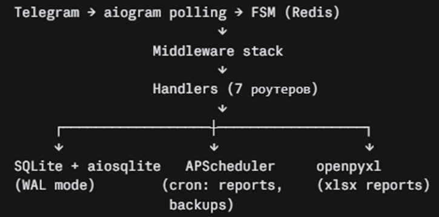
</p>

**Почему такой стек:**

- **aiogram 3** — FSM, middlewares, filters, polling-режим без внешнего webhook-сервера.
- **SQLite + aiosqlite с WAL** — для одного терминала с одним оператором PostgreSQL избыточен. WAL даёт concurrent reads во время записей; миграция на PG спланирована при росте до 10+ concurrent операторов.
- **Redis для FSM** — состояния диалогов переживают рестарт контейнера, пользователь не теряет контекст на полпути регистрации.
- **APScheduler** — cron-задачи (отчёты, бэкапы) внутри процесса бота, без отдельного worker'а.
- **Docker Compose** — один `docker compose up -d` и всё работает на чистой Ubuntu.

---

## Как это работает

### Главное меню и регистрация контейнера

<p align="center">
  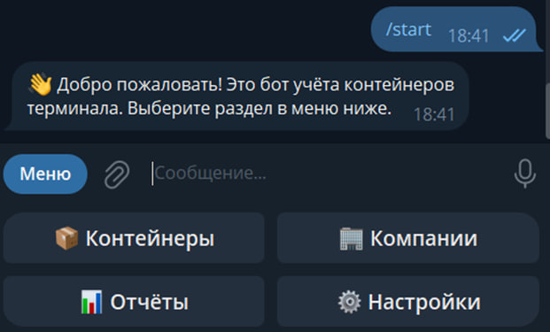
  &nbsp;&nbsp;
  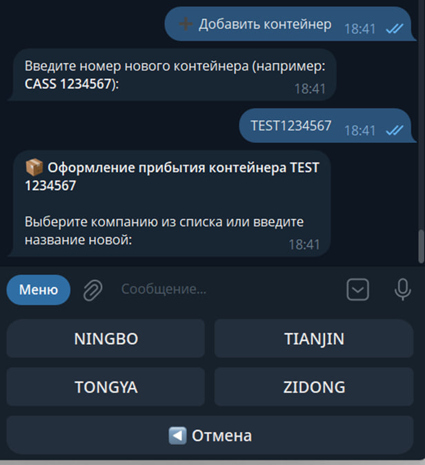
</p>

Чистое 4-кнопочное меню: **Контейнеры / Компании / Отчёты / Настройки**. Регистрация нового контейнера — пользователь вводит номер (`CASS 1234567`), бот валидирует **ISO 6346** (4 латинские буквы + 7 цифр) и сразу предлагает выбрать компанию из списка или создать новую. FSM-поток проведёт до конца, ошибка по формату невозможна.

### Per-company dashboard и биллинг

<p align="center">
  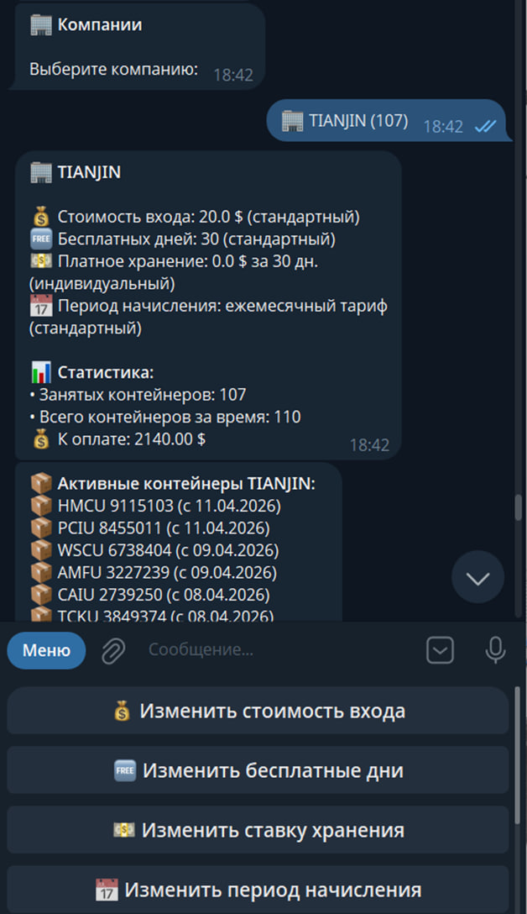
</p>

У каждой компании — живая статистика и настраиваемый тариф:

- **Entry fee:** $20 (стандартный или индивидуальный)
- **Free storage days:** 30
- **Monthly storage rate:** настраивается
- **Billing period:** 30 дней

Пример для TIANJIN: 107 активных контейнеров, 110 обработано всего, $2 140 pending payment. Ниже — список активных контейнеров с датами прибытия. Админ редактирует любой параметр прямо отсюда.

**Формула расчёта долга:**
```
days_stored = (дата вывоза или сегодня) - дата прибытия
billable    = max(0, days_stored - free_days)
storage     = (billable / storage_period_days) * storage_rate
total       = entry_fee + storage
```

### 4 роли доступа

<p align="center">
  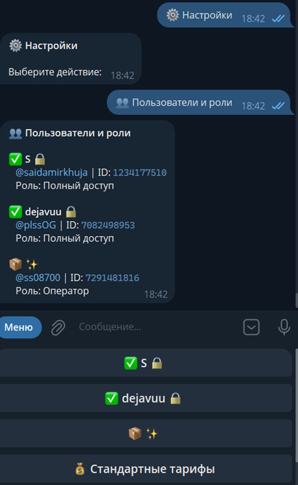
  &nbsp;&nbsp;
  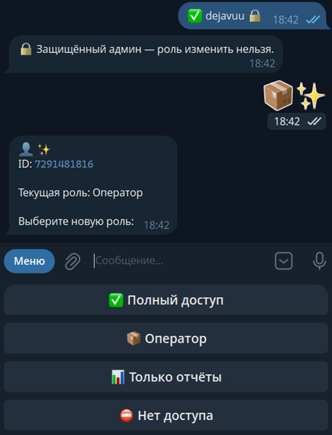
</p>

| Роль | Доступ |
|---|---|
| ✅ Full Access | всё, включая управление пользователями и тарифами |
| 📦 Operator | управление контейнерами |
| 📊 Reports Only | только просмотр и выгрузка отчётов |
| ⛔ No Access | бот игнорирует пользователя |

**Protected admin accounts** (иконка замка) — главные админы заблокированы от случайной смены роли. Бот отвечает: *«Защищённый админ — роль изменить нельзя»*. Саморемонтируемая защита от *«я случайно отобрал у себя доступ»*. Смена роли применяется мгновенно, без рестарта.

### Глобальные тарифы

<p align="center">
  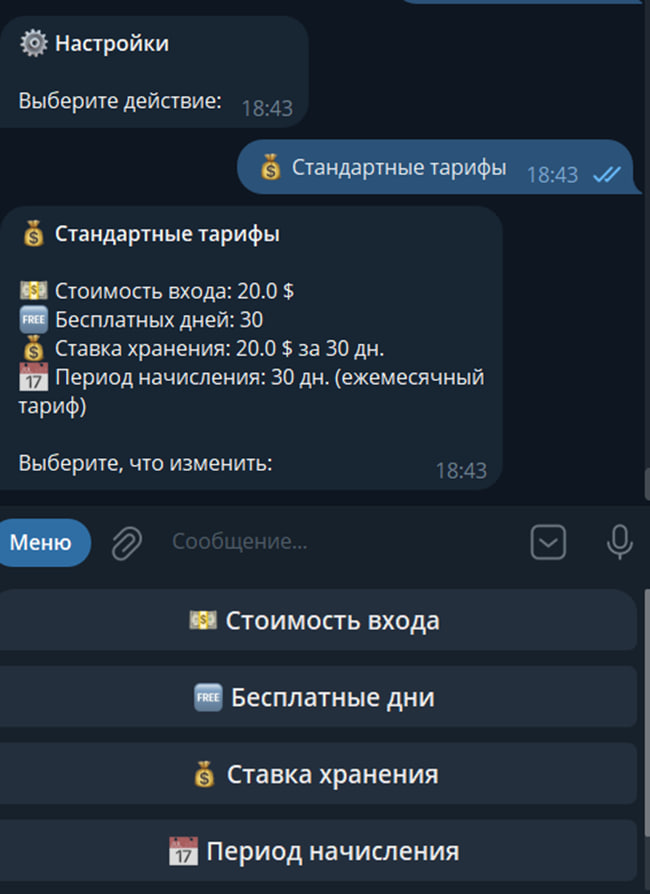
</p>

Дефолтный тариф применяется ко всем компаниям, если у компании не задан индивидуальный. Каждый параметр (вход, free days, ставка, период) редактируется отдельно. Per-company override всегда перебивает глобальный.

### Отчёты xlsx

<p align="center">
  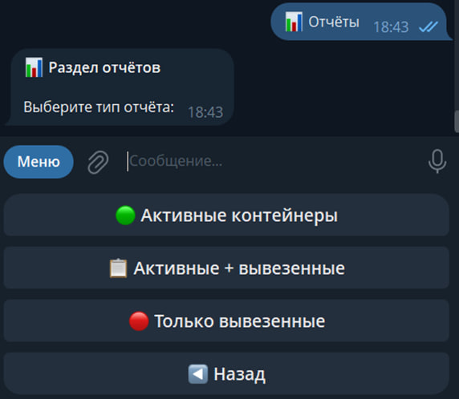
  &nbsp;&nbsp;
  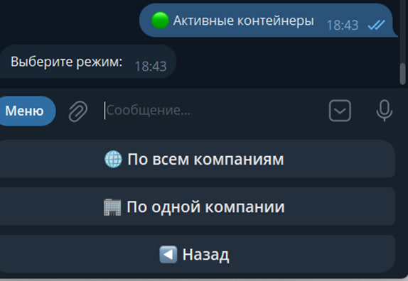
</p>

Три типа отчётов:

- 🟢 **Активные контейнеры** — всё, что сейчас на терминале
- 📋 **Активные + вывезенные** — полная история
- 🔴 **Только вывезенные** — все завершённые

Каждый отчёт — по всем компаниям (общий обзор) или по одной (сфокусированный). Файл генерируется мгновенно и приходит **прямо в чат**:

<p align="center">
  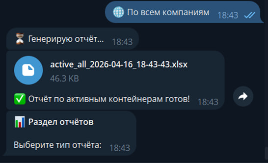
</p>

В xlsx на каждый контейнер — номер, компания, тип, статус, дата прибытия/вывоза, дни на хранении, периоды начисления, entry fee, storage rate, итоговая сумма. Снизу — **итоговая строка**: дни × периоды × сумма. Готово для бухгалтерии.

### Команды

<p align="center">
  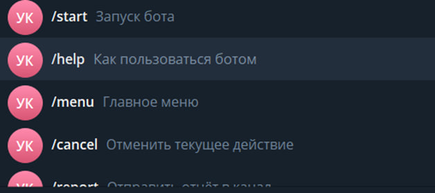
</p>

- `/start` — запуск
- `/help` — как пользоваться
- `/menu` — главное меню
- `/cancel` — отмена текущего действия
- `/report` — отправить отчёт в канал

Работают с любого экрана.

### Real-time канал клиента

<p align="center">
  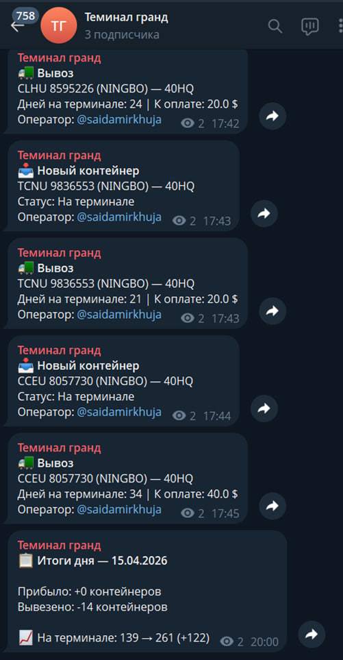
</p>

Каждое событие моментально пушится в канал терминала:

- **Новый контейнер** → номер, компания, тип, статус, оператор.
- **Вывоз** → номер, дни на терминале, сумма к оплате, оператор.

В 20:00 бот отправляет **summary дня**: прибыло / вывезено / live-счётчик остатка на терминале (`139 → 261, +122`).

### Автоматические бэкапы

<p align="center">
  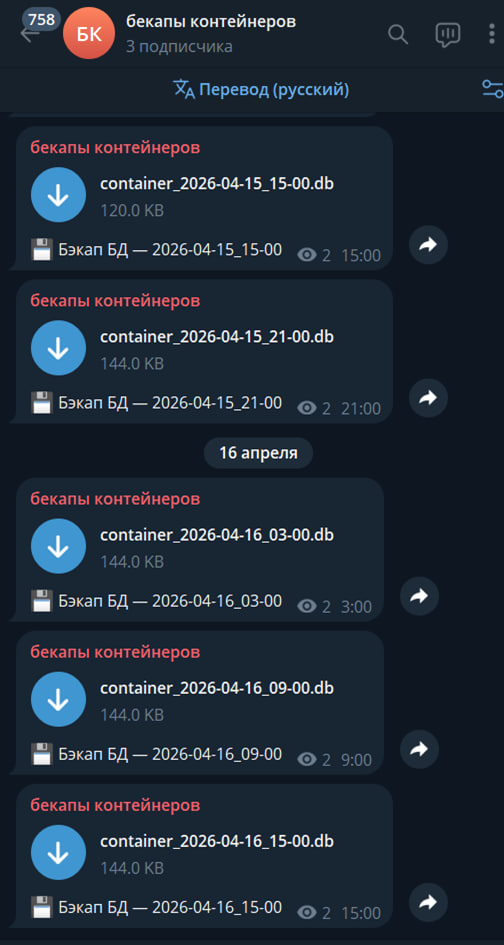
</p>

APScheduler снимает копию SQLite **каждые 6 часов** (03:00 / 09:00 / 15:00 / 21:00) и отправляет `.db` файл с timestamp в имени в приватный Telegram-канал. Восстановление — скачал, положил на место, перезапустил контейнер. Zero ops.

Off-site хранение получается бесплатно, без S3/отдельного storage.

---

## Структура

```
bot.py                 # entry: config → DB init → middlewares → routers → polling
config.py              # dataclass-конфиг из .env с валидацией
states.py              # все FSM-состояния в одном месте

handlers/              # 7 routers по доменам (containers, companies,
                       # reports, users, tariffs, menu, common)
services/              # бизнес-логика: debt calc, report generation,
                       # scheduler jobs, notifications, backups
middlewares/
  chat_filter.py       # бот отвечает только в одобренных чатах/DM
  role.py              # проставляет role в data; handlers проверяют

db/                    # aiosqlite модели + миграции
keyboards/             # inline/reply-клавиатуры
tests/                 # pytest + pytest-asyncio, 60 тестов
```

---

## Запуск

### Требования
- Docker + Docker Compose
- Telegram bot token ([@BotFather](https://t.me/BotFather))

### Локально

```bash
git clone https://github.com/RiobVO/container-terminal-bot.git
cd container-terminal-bot
cp .env.example .env
# заполнить BOT_TOKEN, ADMIN_IDS, GROUP_IDS, BACKUP_CHAT_ID
docker compose up -d --build
docker compose logs -f bot
```

### Переменные окружения

| Variable | Default | Описание |
|---|---|---|
| `BOT_TOKEN` | — | Токен бота от BotFather (required) |
| `ADMIN_IDS` | — | Telegram user IDs главных админов через запятую |
| `GROUP_IDS` | — | Разрешённые чаты (пусто = только DM) |
| `BACKUP_CHAT_ID` | — | Канал для автобэкапов (опционально) |
| `TIMEZONE` | `Asia/Tashkent` | TZ для APScheduler и дат в UI |
| `REPORT_HOUR` | `6` | Час утреннего отчёта |
| `EVENING_REPORT_HOUR` | `20` | Час вечернего summary |
| `DEFAULT_ENTRY_FEE` | `20` | Глобальный entry fee, $ |
| `DEFAULT_FREE_DAYS` | `30` | Глобальные free storage days |
| `DEFAULT_STORAGE_RATE` | `20` | Ставка хранения, $ |
| `DEFAULT_STORAGE_PERIOD_DAYS` | `30` | Период тарификации |

Все дефолты переопределяются per-company в админ-панели.

### Tests

```bash
docker compose exec bot pytest
```

---

## Tech stack

| Слой | Технология |
|---|---|
| Язык | Python 3.12 |
| Framework | aiogram 3.13 (FSM, Middleware, Filters, Routers) |
| БД | SQLite + aiosqlite (WAL mode, concurrent-safe) |
| Cache / FSM | Redis 7 (AOF persistence, everysec fsync) |
| Scheduler | APScheduler 3.10 (TZ-aware cron) |
| Reports | openpyxl 3.1 (xlsx generation) |
| Config | python-dotenv + frozen dataclass |
| Tests | pytest 8.3 + pytest-asyncio |
| Deploy | Docker Compose on DigitalOcean (Ubuntu 24.04) |
| Logs | JSON-file driver, rotated (10M × 3) |

---

## Почему этот проект стоит посмотреть

- **Production с реальными клиентами.** Не pet и не туториал — работает каждый день, считает деньги клиентов.
- **Доменная валидация:** ISO 6346 — международный стандарт маркировки контейнеров.
- **FSM как first-class citizen** (Redis storage), а не «оператор сломал всё, обновив страницу».
- **Protected admin accounts** — защита от human error, о которой думают senior'ы.
- **Automatic backups через Telegram-канал** — дешёвое и надёжное off-site хранение для single-VPS деплоя.
- **Все деньги считаются на бэкенде.** Клиент видит в UI только результат; формула одна для всех xlsx и всех dashboard'ов.
- **SQLite выбран осознанно** — в проекте явно задан порог миграции на PostgreSQL (10+ concurrent операторов).

## Roadmap

- [ ] PostgreSQL миграция при росте до 10+ concurrent операторов
- [ ] Web-админка (React) поверх того же бэкенда
- [ ] Интеграция с 1С для выгрузки в бухгалтерию
- [ ] Multi-tenant изоляция (сейчас один instance = один терминал)

---

## License

Private project. Исходники опубликованы для портфолио — коммерческое использование по согласованию.
