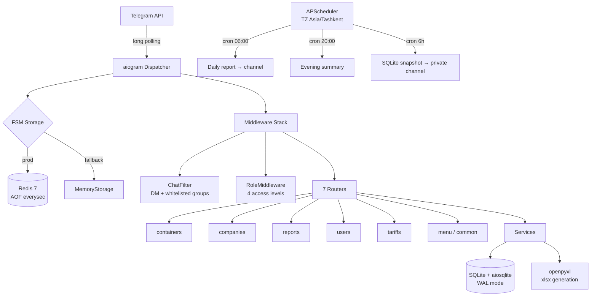

# Container Terminal Management Bot

Telegram-бот для учёта контейнеров на терминалах. Aiogram 3 · SQLite WAL · Redis FSM · APScheduler · Docker.

**Live:** [@Terminal_grand_bot](https://t.me/Terminal_grand_bot) · Производство — 3+ терминала в Минске и Ташкенте, 3 000+ контейнеров · p50 < 80 ms · zero data loss с момента деплоя.

---

## Problem

Клиенты — терминалы морских контейнеров — вели учёт вручную в Excel:
номер контейнера, компания-владелец, даты прибытия/вывоза, тариф.
Данные расходились между сменами, xlsx терялись, суммы к оплате считали калькулятором.

Бот заменил Excel на ролевой интерфейс в Telegram: регистрация контейнера за 5 секунд,
биллинг пересчитывается автоматически, отчёты выгружаются одной командой,
каждое событие пушится в общий канал терминала.

---

## Architecture



### Почему именно такой стек

| Компонент | Выбор | Trade-off |
|---|---|---|
| Framework | **aiogram 3** | Современный async stack, FSM/filters/middleware из коробки. Альтернатива python-telegram-bot более тяжёлая по API. |
| БД | **SQLite + aiosqlite (WAL)** | Single-VPS деплой, один оператор/терминал. WAL даёт concurrent reads при записи. Миграция на PostgreSQL запланирована при 10+ concurrent operators. |
| FSM storage | **Redis 7 с AOF** | Состояния диалога переживают рестарт. Если Redis недоступен, автофолбэк на `MemoryStorage`. |
| Scheduler | **APScheduler in-process** | Cron внутри бота — не нужен отдельный worker/Celery. TZ-aware: все даты в `Asia/Tashkent`. |
| Reports | **openpyxl** | Генерация xlsx в памяти, файл уходит напрямую в чат без записи на диск. |
| Deploy | **Docker Compose** | `up -d` на чистой Ubuntu — bot + redis; bind-mount `./data` под SQLite для zero-downtime бэкапов. |

---

## Domain

### ISO 6346 валидация

Номер контейнера — 4 заглавные латинские буквы + 7 цифр, пробел между ними опционален.
Регулярка применяется до FSM-шага выбора компании: невалидный номер не создаёт состояние в Redis.

```
TEMU 6275401   ✓
CASS1234567    ✓
abc 1234567    ✗  lowercase
TEMU 627540    ✗  6 digits
```

### Формула долга

```
days_stored = (дата вывоза или сегодня) - дата прибытия
billable    = max(0, days_stored - free_days)
storage     = (billable / storage_period_days) * storage_rate
total       = entry_fee + storage
```

`free_days`, `storage_rate`, `storage_period_days`, `entry_fee` берутся из тарифа компании;
если у компании override не задан — из глобальных дефолтов (`DEFAULT_*` env-переменные).

### 4 роли доступа

| Роль | Возможности |
|---|---|
| `full` | Управление пользователями, тарифами, компаниями, контейнерами, отчётами |
| `operator` | CRUD по контейнерам |
| `reports` | Read-only на отчёты |
| `none` | Бот игнорирует пользователя |

**Protected admin accounts.** Пользователи из `ADMIN_IDS` помечены замком: смена их роли заблокирована на уровне handler'а (`users.py`). Это предотвращает сценарий «администратор случайно сделал себя оператором» — классический способ запереть себя вне системы.

### Audit в real-time

Каждое событие пушится в `GROUP_IDS`:
- `container.registered` → номер, компания, тип, статус, оператор
- `container.departed` → дни на терминале, сумма к оплате, оператор

Evening summary в 20:00: приход / вывоз / дельта остатка (`139 → 261, +122`).

### Backups

APScheduler в 03:00 / 09:00 / 15:00 / 21:00 `Asia/Tashkent`:
1. `VACUUM INTO /tmp/snapshot_<ts>.db` — atomic снапшот без блокировки основной БД.
2. `bot.send_document` в `BACKUP_CHAT_ID` (приватный канал).
3. Удаление локального temp-файла.

Восстановление — скачать `.db` из канала, положить в `./data`, `docker compose restart bot`.
Off-site хранение у Telegram, без S3 и отдельного storage-биллинга.

---

## Layout

```
bot.py              # entry: config → DB init → middlewares → routers → polling
config.py           # frozen dataclass из .env с валидацией значений
states.py           # все FSM-состояния

handlers/           # 7 routers — containers / companies / reports /
                    # users / tariffs / menu / common
services/           # debt calc, xlsx generation, scheduler jobs,
                    # notifications, DB backup
middlewares/
  chat_filter.py    # разрешённые чаты/DM
  role.py           # инъекция role в handler data

db/                 # aiosqlite: connection pool, migrations, queries
keyboards/          # inline + reply клавиатуры
tests/              # pytest + pytest-asyncio — 60 tests
```

---

## Run

```bash
git clone https://github.com/RiobVO/container-terminal-bot.git
cd container-terminal-bot
cp .env.example .env           # заполнить BOT_TOKEN, ADMIN_IDS, GROUP_IDS
docker compose up -d --build
docker compose logs -f bot
```

### Environment

| Variable | Default | Purpose |
|---|---|---|
| `BOT_TOKEN` | — | Токен от [@BotFather](https://t.me/BotFather) |
| `ADMIN_IDS` | — | Telegram user IDs главных админов, CSV |
| `GROUP_IDS` | — | Разрешённые чаты; пусто = только DM |
| `BACKUP_CHAT_ID` | — | Приватный канал для auto-backups |
| `REDIS_URL` | — | `redis://redis:6379/0`; пусто = MemoryStorage fallback |
| `TIMEZONE` | `Asia/Tashkent` | Все cron и даты в UI |
| `REPORT_HOUR` | `6` | Утренний отчёт |
| `EVENING_REPORT_HOUR` | `20` | Вечернее summary |
| `DEFAULT_ENTRY_FEE` | `20` | Глобальный entry fee, $ |
| `DEFAULT_FREE_DAYS` | `30` | Глобальные free days |
| `DEFAULT_STORAGE_RATE` | `20` | Ставка хранения, $ |
| `DEFAULT_STORAGE_PERIOD_DAYS` | `30` | Период тарификации |

### Tests

```bash
docker compose exec bot pytest -q
```

---

## Operational notes

- **Logs:** JSON-file driver Docker, ротация `10M × 3`.
- **Non-root user** в контейнере (UID 1000), `chown` на `/app/data`.
- **TZ-aware Dockerfile:** `ENV TZ=Asia/Tashkent` — иначе `datetime.now()` расходится с UI на 5 часов.
- **Redis persistence:** `appendonly yes --appendfsync everysec` — тёплый перезапуск без потери FSM.
- **SQLite WAL:** `PRAGMA journal_mode=WAL` выставляется при инициализации; concurrent readers + один writer.

---

## Roadmap

- PostgreSQL + `asyncpg` при 10+ concurrent операторов (сейчас максимум 3 на терминал)
- Web-админка (React) поверх того же сервисного слоя
- Выгрузка реестра в 1С (CSV с нужной схемой — есть отдельный open issue)
- Multi-tenant: один instance — несколько терминалов (сейчас один-в-один)

---

Исходники опубликованы для портфолио. Коммерческое использование — по согласованию.
